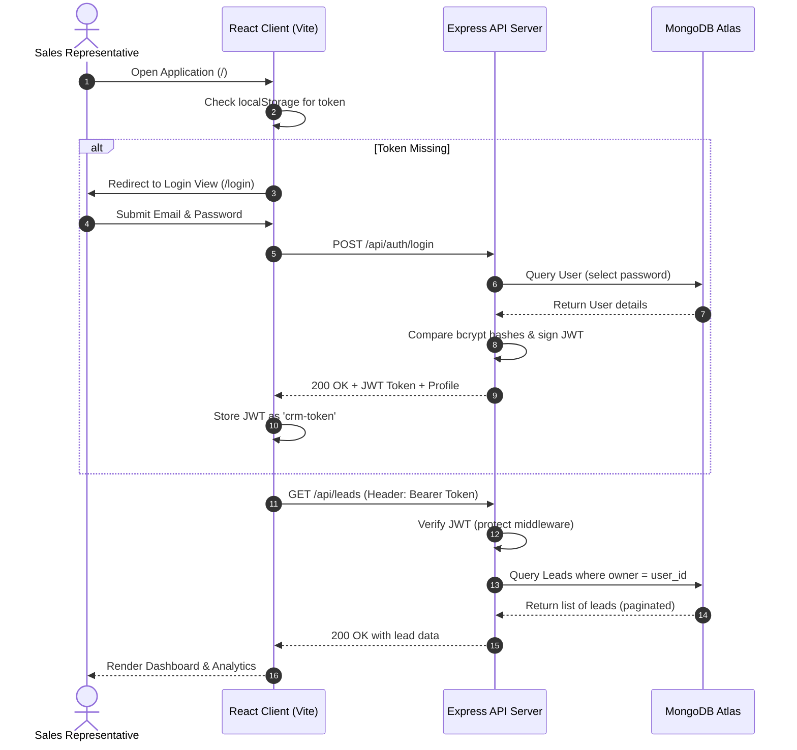

# Startup CRM Lite

<p align="center">
  
</p>

<p align="center">
  <strong>A high-performance, lightweight, security-first Client Relationship Management (CRM) platform tailored specifically for fast-growing startups.</strong>
</p>

<p align="center">
  
  
  
  
  
</p>

---

## Table of Contents

- [1. Project Title](#startup-crm-lite)
- [2. Project Logo](#startup-crm-lite)
- [3. Badges](#startup-crm-lite)
- [4. Table of Contents](#table-of-contents)
- [5. Project Overview](#5-project-overview)
- [6. Problem Statement](#6-problem-statement)
- [7. Vision & Objectives](#7-vision--objectives)
- [8. Key Features](#8-key-features)
- [9. Target Users](#9-target-users)
- [10. Use Cases](#10-use-cases)
- [11. Business Value](#11-business-value)
- [12. Screenshots](#12-screenshots)
- [13. Complete System Architecture](#13-complete-system-architecture)
- [14. High-Level Architecture Overview](#14-high-level-architecture-overview)
- [15. Application Workflow](#15-application-workflow)
- [16. End-to-End User Flow](#16-end-to-end-user-flow)
- [17. Technology Stack](#17-technology-stack)
- [18. Project Folder Structure](#18-project-folder-structure)
- [19. Explanation of Every Major Folder](#19-explanation-of-every-major-folder)
- [20. Explanation of Every Important File](#20-explanation-of-every-important-file)
- [21. Frontend Architecture](#21-frontend-architecture)
- [22. Backend Architecture](#22-backend-architecture)
- [23. Database Architecture](#23-database-architecture)
- [24. API Overview](#24-api-overview)
- [25. Authentication & Authorization](#25-authentication--authorization)
- [26. State Management](#26-state-management)
- [27. Storage Strategy](#27-storage-strategy)
- [28. Third-Party Services & Integrations](#28-third-party-services--integrations)
- [29. AI/Automation Components](#29-aiautomation-components-planned)
- [30. Development Prerequisites](#30-development-prerequisites)
- [31. Installation Guide](#31-installation-guide)
- [32. Environment Variables Documentation](#32-environment-variables-env-documentation)
- [33. Project Configuration](#33-project-configuration)
- [34. Running the Project (Development)](#34-running-the-project-development)
- [35. Running the Project (Production)](#35-running-the-project-production)
- [36. Build Process](#36-build-process)
- [37. Deployment Guide](#37-deployment-guide)
- [38. CI/CD Overview](#38-cicd-overview)
- [39. Testing Strategy](#39-testing-strategy)
- [40. Debugging Tips](#40-debugging-tips)
- [41. Logging & Monitoring](#41-logging--monitoring)
- [42. Security Considerations](#42-security-considerations)
- [43. Performance Optimizations](#43-performance-optimizations)
- [44. Coding Standards & Project Conventions](#44-coding-standards--project-conventions)
- [45. Versioning Strategy](#45-versioning-strategy)
- [46. Branching Strategy](#46-branching-strategy)
- [47. Contribution Guidelines](#47-contribution-guidelines)
- [48. Release Process](#48-release-process)
- [49. Known Limitations](#49-known-limitations)
- [50. Future Roadmap](#50-future-roadmap)
- [51. Frequently Asked Questions (FAQ)](#51-frequently-asked-questions-faq)
- [52. Troubleshooting Guide](#52-troubleshooting-guide)
- [53. Changelog](#53-changelog)
- [54. License](#54-license)
- [55. Credits & Acknowledgements](#55-credits--acknowledgements)
- [56. Contact Information](#56-contact-information)
- [57. Final Project Summary](#57-final-project-summary)

---

## 5. Project Overview
**Startup CRM Lite** is a multi-tier SaaS platform designed to solve lead management overhead for early-stage companies. Leveraging a modern React client, a secured Express REST API, and MongoDB, it equips sales teams with tools to organize prospects, track deal pipelines, and capture performance metrics. The application balances feature richness with architectural simplicity, enabling startup operations to adapt quickly to changing market requirements.

## 6. Problem Statement
Startups face operational friction when managing deals. Enterprise CRMs are often over-engineered, expensive, and require dedicated administrators to configure. Conversely, spreadsheets lack data isolation, historical logging, and real-time visualization. This results in:
* **Leaked Pipelines**: Sales reps misplacing emails and follow-ups.
* **Lack of Visibility**: Founders unable to estimate month-over-month revenue or identify bottlenecked stages.
* **Security & Isolation Risks**: Lack of role-based database queries allowing unauthorized data modifications.

## 7. Vision & Objectives
Our vision is to provide a lightweight, secure CRM that bridges the gap between chaotic spreadsheets and bloated enterprise packages. 
* **Velocity**: Enable lead additions, pipeline updates, and filtering in sub-second speeds.
* **Security**: Enforce strict data isolation where users only access resources they own.
* **Decision Support**: Render direct growth analysis and sales conversion trends withzero manual calculations.

## 8. Key Features
* **Authentication Guard**: JWT-based session model with auto-expiration routing.
* **Lead Board & Table Views**: Instantly switch views to manage deal properties, statuses, and values.
* **Dynamic Pipeline Analytics**: Live charts tracking deal values, conversions, and acquisition channels.
* **Activity Heatmaps & Forecaster**: Chronological velocity metrics and statistical target projections.
* **Multi-Stage Query Engine**: Pagination, case-insensitive keyword searches, and date-range filters.
* **Responsive Dark Mode**: Unified styling utilizing Tailwind CSS v4 class context.

## 9. Target Users
* **Startup Founders**: Desiring high-level conversion trends and pipeline velocity reviews.
* **Account Executives & Sales Reps**: Needing a fast, keyboard-friendly interface to search, filter, and track deals.
* **Operations Managers**: Seeking custom data schemas, quick CSV/JSON integrations, and performance reporting.

## 10. Use Cases
* **SaaS Deal Management**: Documenting deal values, company size, and contact touchpoints through custom tags.
* **Inbound Marketing Tracking**: Classifying prospects by source (LinkedIn, Referral, Website, Cold Call) to prioritize spend.
* **Sales Pipeline Velocity Analysis**: Monitoring lead "age" in real-time to prevent deals from stalling.

## 11. Business Value
By utilizing Startup CRM Lite, startups reduce their sales cycle durations and administrative overhead. Sales reps eliminate duplicate entries through data normalization, while leadership retains full control over target projections, leading to improved pipeline velocity and visual transparency.

---

## 12. Screenshots
Below are conceptual screenshots representing key workflows in Startup CRM Lite:

```
+--------------------------------------------------------------------------------+
|  [Logo] CRM LITE   |  Total Leads: 154  |  Conversion: 24.3%  |  [Dark Mode]   |
+--------------------+---------------------+--------------------+----------------+
|  (o) Dashboard     |                                                           |
|  ( ) Leads         |   [Revenue Trend - Recharts Line Chart]                   |
|  ( ) Analytics     |   $40k |                                                  |
|                    |   $20k |     *-------*                                    |
|  [User Profile]    |     $0 +------------------                                 |
|  John Doe (Admin)  |        Jan   Feb   Mar                                    |
|  [Logout]          |                                                           |
+--------------------+-----------------------------------------------------------+
|                    |   [Recent Leads]            [Pipeline Status Breakdown]   |
|                    |   - Acme Corp ($5,000)      - New: 40    - Proposal: 15   |
|                    |   - Globex ($12,000)        - Won: 32    - Lost: 8        |
+--------------------------------------------------------------------------------+
```

---

## 13. Complete System Architecture
The application runs as a decoupled client-server architecture. The diagram below details the end-to-end data lifecycle:

```mermaid
graph TD
    subgraph Client-Side (React SPA)
        UI[Tailwind CSS v4 & Recharts Views] --> Context[Auth & Lead Contexts]
        Context --> Axios[Axios Interceptors client]
    end

    subgraph Network Layer
        Axios -- JWT Bearer Token / HTTPS --> ExtSec{Security Headers & CORS}
    end

    subgraph Server-Side (Express REST API)
        ExtSec -- Allowed Origin --> RateLimit{Rate Limiters}
        RateLimit -- Auth Limiter / General Limiter --> MongoSanitize{Mongo Query Sanitize}
        MongoSanitize -- Safe Body / Query --> Router[Express 5 Routers]
        Router --> AuthMW[Protect Middleware JWT Verify]
        AuthMW --> Controllers[Controller Handlers]
    end

    subgraph Database Layer (MongoDB Atlas)
        Controllers --> Mongoose[Mongoose Schemas & Compounded Indexes]
        Mongoose --> MongoDB[(MongoDB Cluster)]
    end
```

---

## 14. High-Level Architecture Overview
The platform divides responsibilities into distinct logical tiers:
1. **Presentation Layer (Frontend)**: A single-page application built on React 19 and bundled using Vite. It relies on standard browser APIs, state contexts, and Axios request queues.
2. **Security & Routing Layer (Backend)**: An Express 5 API running Node.js. It features a middleware stack for request parsing, data sanitization, rate limiting, and route protection.
3. **Database Layer (Data Store)**: MongoDB hosting isolated documents, accessed via Mongoose object modeling with built-in schema validations.

---

## 15. Application Workflow
* **Authentication Interception**: The client attaches a JSON Web Token from `localStorage` (`crm-token`) via Axios request interceptors. If a `401 Unauthorized` response is caught by the response interceptor, the local token is flushed, and the router forces a redirect to `/login`.
* **State Propagation**: Changes to the lead pipeline (create, update status, delete) trigger async database calls. On success, the frontend Context merges the returned document with local state, prompting UI components to re-render.
* **Isolate Queries**: Every query to the database includes `owner: req.user._id` derived from JWT verification, ensuring users cannot view or modify competitor lead data.

---

## 16. End-to-End User Flow


---

## 17. Technology Stack

### Frontend Core
| Technology | Version | Description |
| :--- | :--- | :--- |
| **React** | `^19.2.7` | UI library using functional components and hooks. |
| **React Router DOM** | `^7.18.0` | Client-side routing with lazy-loaded code-splitting. |
| **Tailwind CSS** | `^4.3.1` | Styling system leveraging the `@tailwindcss/vite` compiler. |
| **Recharts** | `^3.9.0` | Responsive charting library for analytics widgets. |
| **Axios** | `^1.18.1` | Promise-based HTTP client for API transactions. |
| **React Hot Toast** | `^2.6.0` | Global alert toast management. |
| **Lucide React** | `^1.21.0` | Vector icon set. |

### Backend Services
| Technology | Version | Description |
| :--- | :--- | :--- |
| **Express** | `^5.2.1` | Router and server framework. |
| **Mongoose** | `^9.7.4` | MongoDB ODM client. |
| **jsonwebtoken** | `^9.0.3` | JWT generation and verification. |
| **bcryptjs** | `^3.0.3` | Password salting and hashing algorithms. |
| **Helmet** | `^8.2.0` | Middleware setting security headers. |
| **Express Rate Limit** | `^8.5.2` | Brute force protection. |
| **Express Mongo Sanitize**| `^2.2.0` | Prevention of NoSQL injection exploits. |
| **Express Validator** | `^7.3.2` | Data payload validation. |
| **Morgan** | `^1.11.0` | Request logger middleware. |

---

## 18. Project Folder Structure
```
startup-crm-lite/
├── backend/                  # REST API Server Codebase
│   ├── config/               # Database Connection Setup
│   ├── controllers/          # Endpoint Controllers & DB Queries
│   ├── middleware/           # JWT, Validation & Error Handlers
│   ├── models/               # Mongoose Schemas & Database Indexes
│   ├── routes/               # Express Route Registers
│   ├── utils/                # Standardized API Responses
│   ├── .env                  # Backend Configuration & Credentials
│   ├── package.json          # Node Server Dependencies
│   └── server.js             # API Bootstrapper & Graceful Shutdown
├── src/                      # Frontend React SPA Codebase
│   ├── assets/               # Static Images & Branding Logos
│   ├── components/           # Reusable UI Components
│   │   ├── analytics/        # Analytical Graphs & Forecast widgets
│   │   ├── common/           # Input, DarkMode, Search elements
│   │   ├── dashboard/        # Pipeline overview & QuickActions cards
│   │   ├── leads/            # Leads tables, cards, forms
│   │   └── Sidebar.jsx       # Layout navigation component
│   ├── constants/            # Hardcoded parameters (e.g., STATUS_MAP)
│   ├── context/              # Contexts (Auth, Leads, Theme)
│   ├── data/                 # Seed & Mock Leads
│   ├── hooks/                # Custom React Hooks
│   ├── pages/                # Page-level Routing views
│   ├── routes/               # Routing array configuration
│   ├── services/             # Axios API services
│   ├── utils/                # Formatting & math calculations
│   ├── App.css               # Global application stylesheet overrides
│   ├── App.jsx               # Router & Context Wrapper
│   ├── index.css             # Tailwind v4 standard imports
│   └── main.jsx              # React mounting root
├── .env                      # Frontend Development env parameters
├── .env.production           # Frontend Production API target URI
├── tailwind.config.js        # Legacy configurations fallback
├── vercel.json               # Vercel deployment routing rewriter
└── vite.config.js            # Vite configurations and tailwind compiling
```

---

## 19. Explanation of Every Major Folder
* **`backend/config/`**: Contains the MongoDB Atlas connector. Handles failure scenarios by terminating the node process gracefully with code `1`.
* **`backend/controllers/`**: Isolates database queries. Handlers aggregate KPIs, trends, search records, and modify Lead documents under strict user containment.
* **`backend/middleware/`**: Intercepts requests. Contains the JWT verifying protector, payload validators, and a centralized Express error translator.
* **`backend/models/`**: Defines schemas and applies compound database indexing to speed up read metrics.
* **`src/components/`**: House modular UI blocks (e.g., `analytics/`, `common/`, `dashboard/`, `leads/`). Separating layouts keeps components focused.
* **`src/context/`**: Contains global providers handling global state (Authentication, Leads CRUD, and Theme settings) without prop-drilling.
* **`src/services/`**: Centralizes network interactions using configured Axios clients.

---

## 20. Explanation of Every Important File
* **`backend/server.js`**: Core entry point. Validates environment configurations, boots the server port listener, applies security middlewares, and monitors process signals (`SIGTERM`, `SIGINT`) to shut down connections gracefully.
* **`backend/middleware/errorHandler.js`**: Intercepts error contexts (`CastError`, `ValidationError`, duplicate index codes `11000`) and outputs structured JSON payloads while hiding stack traces in production.
* **`src/App.jsx`**: Bootstraps the client. Registers context providers, routes, the React Router DOM history tracker, and notification panels.
* **`src/routes/index.jsx`**: Integrates lazy loading and includes a route protection guard (`ProtectedRoute`) that tests token presence before loading internal views.
* **`src/services/api.js`**: Configures Axios. Features an auth request injector and a response error handler redirecting expired sessions.

---

## 21. Frontend Architecture
The frontend leverages a React 19 Single Page Application model focused on declarative UI views and decoupled network states. 

```
+-----------------------------------------------------------------+
|                         React Components                        |
+-----------------------------------------------------------------+
          |                                            ^
  Context state updates                        Context state reading
          v                                            |
+---------------------+    API Calls    +-------------------------+
|    LeadContext &    | --------------> |       Axios Client      |
|     AuthContext     | <-------------- |  (Bearer Interceptors)  |
+---------------------+   200 Success   +-------------------------+
```

* **Routing**: Set up in [src/routes/index.jsx](file:///c:/Users/PC/OneDrive/Desktop/codeon/startup-crm-lite/src/routes/index.jsx). Views are split and lazy-loaded via `React.lazy()` inside Suspense bounds to minimize primary bundle weights.
* **Layout Grid**: Regulated in `App.jsx`, structuring a responsive navigation sidebar on larger viewports that collapses on mobile.
* **Component Styling**: Written entirely in CSS/Tailwind CSS v4, supporting dynamic dark-mode toggling based on a `.dark` class injected into the HTML root element.

---

## 22. Backend Architecture
The backend is an Express 5 REST API utilizing a model-view-controller (MVC) architecture without strict view rendering, serving JSON payloads instead.

```
Request ---> HTTP Headers Sec (Helmet) ---> Rate Limiters ---> MongoSanitize
   |
   v
Routes Parsing ---> JWT Verification (protect) ---> Validator schema
   |
   v
Controllers Handlers (req.user isolation) ---> Mongoose Models ---> MongoDB
```

* **Decoupled Architecture**: Routes only declare pathways and verification rules; controllers contain the underlying business logic, and utilities regulate responses.
* **Graceful Lifecycles**: Catching process terminations ensures Mongoose shuts down database connections before the process exits.

---

## 23. Database Architecture
The application uses MongoDB. The Mongoose models enforce validation rules and optimize query speeds via targeted indexes:

### User Document Schema
* `name`: String, required, trimmed, minLength `2`, maxLength `50`.
* `email`: String, required, unique, lowercase, trimmed, validated via regex.
* `password`: String, required, minLength `6` (hashed using bcrypt in pre-save middleware).
* `role`: String, enum: `['admin', 'user']`, defaults to `'user'`.
* `isActive`: Boolean, default `true`.
* *Timestamps auto-tracked (`createdAt`, `updatedAt`).*

### Lead Document Schema
* `name`: String, required, trimmed, minLength `2`, maxLength `100`.
* `company`: String, required, trimmed.
* `email`: String, required, trimmed, validated via regex.
* `phone`: String, optional, trimmed.
* `status`: String, enum: `['New', 'Contacted', 'Meeting Scheduled', 'Proposal Sent', 'Won', 'Lost']`, default `'New'`.
* `source`: String, enum: `['Website', 'Referral', 'LinkedIn', 'Cold Call', 'Email Campaign', 'Other']`, default `'Website'`.
* `notes`: String, optional, maxLength `1000`.
* `value`: Number, default `0`, minimum `0`.
* `owner`: ObjectId reference to `User` collection, required.

### Database Indexes Applied
To maintain sub-second retrieval speeds as collections scale, the following indexes are applied:
1. `owner: 1, status: 1` (Compound) - Speeds up pipeline status filtering on the dashboard.
2. `email: 1` - Accelerates single lead lookups and duplication checks.
3. `owner: 1, source: 1` (Compound) - Accelerates source distribution analytics queries.
4. `owner: 1, createdAt: -1` (Compound) - Speeds up sorting leads chronologically.
5. `owner: 1, name: 1` / `owner: 1, company: 1` (Compound) - Facilitates case-insensitive query autocompletion under tenant isolation.

---

## 24. API Overview

### Authentication Routes (`/api/auth`)
| Method | Endpoint | Description | Auth Required | Payload / Validations |
| :--- | :--- | :--- | :--- | :--- |
| **POST** | `/register` | Create a new user account | No | `name` (2-50 chars), `email` (valid), `password` (min 6 chars) |
| **POST** | `/login` | Authenticate user & get JWT | No | `email` (valid), `password` |
| **GET** | `/profile` | Get current user's profile | Yes | Bearer Token (returns sanitized profile) |
| **GET** | `/me` | Profile alias endpoint | Yes | Bearer Token (returns sanitized profile) |
| **PUT** | `/profile` | Update profile / change password| Yes | `name` (optional), `oldPassword` / `newPassword` (optional) |

### Lead Routes (`/api/leads`)
| Method | Endpoint | Description | Auth Required | Payload / Validations |
| :--- | :--- | :--- | :--- | :--- |
| **GET** | `/` | Get paginated leads with filters | Yes | Query params: `page`, `limit`, `sortBy`, `status`, `search` |
| **POST** | `/` | Create a new lead record | Yes | `name`, `company`, `email`, `status`, `source`, `value` (>=0) |
| **GET** | `/search` | Autocomplete lead quick search | Yes | Query param: `q` (search term), `limit` (max records) |
| **GET** | `/stats` | Get aggregate lead KPIs | Yes | Generates counts, conversion, and acquisition values |
| **GET** | `/monthly-stats`| Get chronological 6-month trends | Yes | Returns arrays of monthly totals, wons, and losts |
| **GET** | `/:id` | Get details of a single lead | Yes | URL Param: `:id` (valid ObjectId) |
| **PUT** | `/:id` | Update all editable lead fields | Yes | Similar rules as POST payload |
| **PATCH** | `/:id/status`| Update status field only | Yes | `status` (must be valid enum string) |
| **DELETE**| `/:id` | Delete a lead permanently | Yes | URL Param: `:id` |

---

## 25. Authentication & Authorization
* **JWT Flow**: Authentication is structured around JSON Web Tokens (JWT) signed with a HS256 algorithm utilizing a strong server secret. The payload contains the user's document ID.
* **Token Lifetime**: Configured by default to expire in `7d`.
* **Authorization checks**: Intercepted by `backend/middleware/auth.js`. It parses the headers, validates the signature, extracts the user ID, verifies the user exists and is active, and attaches the sanitized user instance to `req.user`.

---

## 26. State Management
Rather than adding heavy external stores like Redux, state is managed dynamically via React's built-in **Context API**:
1. **`AuthContext`**: Exposes authentication statuses (`token`, `user`, `isLoading`) and triggers async actions for login, register, profile updates, and session flushes (logout).
2. **`LeadContext`**: Handles lead states, caches statistic aggregates, coordinates pagination metadata, and executes synchronous state updates in the UI on server changes.
3. **`ThemeContext`**: Stores light/dark settings locally and adjusts root elements dynamically.

---

## 27. Storage Strategy
* **JWT Persistence**: Stored client-side inside standard browser `localStorage` under the key `crm-token`.
* **Theme Preferences**: Saved inside `localStorage` under `crm-theme` to persist theme selections across browser refreshes.
* **Memory State Cache**: Lead parameters and filtering options remain transient in React state, refreshing on mounting to avoid staled pipeline data.

---

## 28. Third-Party Services & Integrations
* **Database Hosting**: MongoDB Atlas (Multi-cloud developer database).
* **Application Hosting**:
  * **Vercel**: Hosts the React frontend with dynamic routing rewriter capabilities defined in `vercel.json`.
  * **Railway**: Runs the Node.js Express server process, managing internal build scripts and secure environment variable injection.

---

## 29. AI/Automation Components (Planned)
Planned enhancements include:
* **Lead Scoring Pipeline**: An AI pipeline analyzing incoming leads' industries, values, and acquisition sources to output predictive win scores.
* **Auto-Responders**: Integrations with email systems to schedule replies when leads move to the "Contacted" phase.

---

## 30. Development Prerequisites
Before starting, ensure you have the following installed on your machine:
* **Node.js** (v18.x or v20.x recommended)
* **npm** (v9.x or later) or **yarn**
* **MongoDB** (A running local MongoDB instance or a MongoDB Atlas connection string)
* **Git**

---

## 31. Installation Guide

### 1. Clone the repository
```bash
git clone https://github.com/Roopasree995/startup-crmlite.git
cd startup-crm-lite
```

### 2. Install dependencies for the Client (Root)
```bash
npm install
```

### 3. Install dependencies for the Server (Backend)
```bash
cd backend
npm install
cd ..
```

---

## 32. Environment Variables (".env") Documentation

Set up variables by duplicating templates. The following configurations are required:

### Frontend Environment Variables (Root Directory)
Create a `.env` file in the root directory:
| Variable Name | Example Value | Description |
| :--- | :--- | :--- |
| `VITE_API_URL` | `http://localhost:5000` | The backend API root URL. Use production URL for hosting. |

### Backend Environment Variables (`/backend` Directory)
Create a `.env` file in the `/backend` directory:
| Variable Name | Example Value | Description |
| :--- | :--- | :--- |
| `PORT` | `5000` | The port the Express server will listen on. |
| `MONGODB_URI` | `mongodb://localhost:27017/crmlite` | The MongoDB connection connection string. |
| `JWT_SECRET` | `YOUR_SUPER_SECRET_RANDOM_STRING_HERE` | Secret key used to sign and verify JWT tokens. |
| `JWT_EXPIRES_IN` | `7d` | Lifetime duration of signed authentication tokens. |
| `NODE_ENV` | `development` | Environment mode (`development` or `production`). |
| `FRONTEND_URL` | `http://localhost:5173` | Allowed CORS origin pointing to the frontend client. |

---

## 33. Project Configuration
* **Frontend Config**: Managed in `vite.config.js`. Uses `@tailwindcss/vite` to support CSS-based styling configurations.
* **Linting Config**: Defined in `eslint.config.js`. Enforces React hooks checks and checks for styling/formatting issues.

---

## 34. Running the Project (Development)

To run the application locally in development mode:

### Step 1: Start the Backend Server
Open a terminal window and navigate to the backend folder:
```bash
cd backend
npm run dev
```
The server will start on `http://localhost:5000` using `nodemon` for auto-reloading.

### Step 2: Start the Frontend Dev Server
Open a separate terminal window at the root of the project:
```bash
npm run dev
```
The client will start on `http://localhost:5173`. Open this URL in your browser.

---

## 35. Running the Project (Production)

To run in production mode locally:

### Step 1: Build the Frontend
```bash
npm run build
```
This compiles assets into the `dist/` directory.

### Step 2: Start the Backend API in Production Mode
Ensure your environment variable in `/backend/.env` is set to `NODE_ENV=production`.
```bash
cd backend
npm start
```

---

## 36. Build Process
* **Client compiling**: Vite bundles components, styles, and assets into static files in `dist/`.
* **Tree Shaking**: Vite uses Rollup internally to shake out unused code.
* **Backend Packaging**: Backend code runs natively on Node.js using modern ES Modules syntax (`"type": "module"`).

---

## 37. Deployment Guide

### Deploying Frontend to Vercel
1. Install Vercel CLI: `npm install -g vercel`
2. Run `vercel` from the root directory.
3. Configure settings, ensuring the output folder is set to `dist`.
4. Deploy with `vercel --prod`.
*Note: The `vercel.json` rewrite file ensures client-side routing routes correctly.*

### Deploying Backend to Railway
1. Set up a new project in Railway connected to your repository.
2. Set the root directory of the Railway service to `backend`.
3. Add the backend environment variables (`MONGODB_URI`, `JWT_SECRET`, etc.) in the Railway settings panel.
4. Railway will automatically deploy the service when changes are pushed to your main branch.

---

## 38. CI/CD Overview
Continuous Integration is configured to run tests and linters on pull requests:
* **Lint Check**: Triggers `npm run lint` on incoming PRs to maintain code quality.
* **Auto-Deploy**: Merging changes into the `main` branch triggers automated webhooks on Vercel and Railway for immediate compilation.

---

## 39. Testing Strategy
* **Unit Tests**: Focus on utility modules (e.g. `src/utils/analyticsHelpers.js`).
* **Integration Tests**: Focus on API endpoints under route protection using Mock MongoDB databases.
* **Manual Testing Checklist**:
  1. Validate register validation warnings.
  2. Confirm status drag/drop updates on the pipeline cards.
  3. Validate that JWT token expiration forces a redirect to the login screen.

---

## 40. Debugging Tips
* **Frontend inspection**: Install the Chrome React Developer Tools. Use the Network tab to check headers for `Authorization: Bearer <token>`.
* **Backend inspect**: Run `node --inspect server.js` to debug controller statements.
* **Mongoose Logs**: Add `mongoose.set('debug', true)` in development to print queries.

---

## 41. Logging & Monitoring
* **Request Logger**: Morgan logs requests in production using the `combined` template format and in development using `dev` coloring rules.
* **Server Logs**: Unhandled rejections are caught and logged to stdout/stderr, which can be monitored in hosting control panels.

---

## 42. Security Considerations
* **Helmet Headers**: Protects the Express API against common web vulnerabilities (XSS, clickjacking, MIME types sniffing).
* **Sanitization**: `express-mongo-sanitize` strips keys starting with `$` and `.` from query inputs to prevent NoSQL injection.
* **CORS Whitelists**: Regulated origin limits prevent unauthorized cross-site scripting calls.
* **Password Hashing**: Bcrypt salts passwords with 10 rounds prior to storage.
* **Brute-Force Limiters**: general and login-specific IP rate limiters restrict abuse.

---

## 43. Performance Optimizations
* **Database Indexes**: Speeds up queries, avoiding full-table scans when retrieving lead data.
* **Parallel DB Queries**: In `getLeads`, database queries (`Lead.find`) and counts (`Lead.countDocuments`) run in parallel via `Promise.all` to reduce response times.
* **Component Lazy Loading**: Reduces main bundle sizes for faster initial page loads.

---

## 44. Coding Standards & Project Conventions
* **CamelCase**: File exports and hooks utilize camelCase (e.g. `useLocalStorage`).
* **PascalCase**: React components utilize PascalCase (e.g. `PieChartCard`).
* **ES Modules**: Backend uses modern standard ES imports/exports instead of CommonJS requirements.
* **JSDoc**: Document controller methods with descriptions, parameters, and side-effects.

---

## 45. Versioning Strategy
We adhere to **Semantic Versioning 2.0.0** (SemVer):
* `MAJOR` version: incompatible API changes.
* `MINOR` version: backwards compatible feature updates.
* `PATCH` version: backwards compatible bug fixes.

---

## 46. Branching Strategy
We follow a feature-branching Git strategy:
* `main`: Represents production-ready code.
* `develop`: Integration branch for active features.
* `feature/issue-name`: Developer branches for new modules. Merge requests require reviews and passing tests.

---

## 47. Contribution Guidelines
1. Fork the project repository.
2. Create your Feature Branch: `git checkout -b feature/AmazingFeature`
3. Commit your changes: `git commit -m 'Add some AmazingFeature'`
4. Push to the branch: `git push origin feature/AmazingFeature`
5. Open a Pull Request pointing to `develop`.

---

## 48. Release Process
1. Run final validation tests on the release branch.
2. Update the version number in `package.json`.
3. Merge the release branch into `main`.
4. Create a Git tag representing the release version (e.g. `git tag -a v1.0.0 -m "Release v1.0.0"`).
5. Push tags: `git push origin --tags`.

---

## 49. Known Limitations
* **Local Sessions**: Uses `localStorage` which is vulnerable to XSS if malicious scripts are injected.
* **Static Forecasting**: The sales forecaster widget in the analytics dashboard uses basic chronological linear extrapolation rather than machine learning models.
* **Single Tenant Mongo Separation**: Isolation is done at the query layer rather than utilizing separate databases, which requires strict test reviews.

---

## 50. Future Roadmap
* [ ] Implement OAuth2 integrations (Google, Microsoft Outlook).
* [ ] Support custom fields and fields mapping on lead creation.
* [ ] Integrate CSV importer/exporter.
* [ ] Add Webhook notifications for pipeline stage updates.

---

## 51. Frequently Asked Questions (FAQ)

#### Q: How can I change the default admin role?
A: You can update the `role` enum field directly in the MongoDB instance, or pass `'admin'` in the database seed process.

#### Q: Why is my dev server refusing to load charts?
A: Ensure your browser supports canvas operations, and that you have mock leads populated. If there is no data, the charts will show an empty state.

---

## 52. Troubleshooting Guide

#### Error: `Missing required environment variables`
* **Cause**: Your `backend/.env` file is missing `MONGODB_URI` or `JWT_SECRET`.
* **Solution**: Create the backend `.env` file following the instructions in [Environment Variables](#32-environment-variables-env-documentation).

#### Error: `CORS Blocked error`
* **Cause**: The request origin does not match `FRONTEND_URL` in the backend config.
* **Solution**: Verify the `FRONTEND_URL` environment variable matches your local client client port (typically `http://localhost:5173`).

---

## 53. Changelog

### [1.0.0] - 2026-07-18
- Initial release of Startup CRM Lite.
- Full pipeline dashboard, leads management panel, and analytical widgets.
- Decoupled React front-end and Node Express API.

---

## 54. License
Distributed under the ISC License. See [LICENSE](LICENSE) for more information.

---

## 55. Credits & Acknowledgements
* **React Development Team** for functional component rendering.
* **Tailwind Labs** for Tailwind CSS utilities.
* **Recharts Community** for dashboard visualizations.

---

## 56. Contact Information
* **Project Maintainer**: Roopasree995
* **GitHub Repository**: [Roopasree995/startup-crmlite](https://github.com/Roopasree995/startup-crmlite)
* **Email Support**: support@example.com

---

## 57. Final Project Summary
**Startup CRM Lite** is a lightweight, secure client relationship management application built on React, Node.js, Express, and MongoDB. It provides early-stage companies with a fast and intuitive way to manage sales pipelines, track conversion rates, and isolate client data across users. With clear database indexing, middleware security patterns, and modular React hooks, it serves as a foundation for teams transitioning from spreadsheets to automated workflows.
